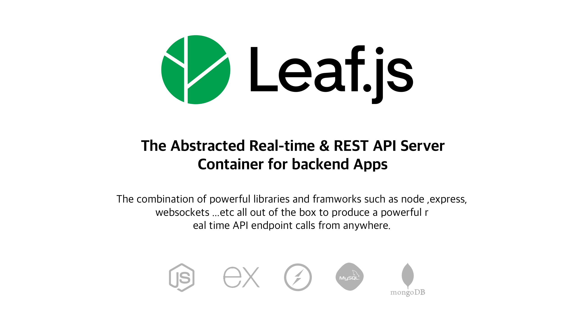

# Welcome to Leaf.js
---
## The Abstracted Realtime & REST API Server Container
leaf.js is a server container consisting of the following stacks 
- node 
- socket.io
- express
- mysql
- mongodb
- nodemon (for fast refresh , check package.json for settings).

these have been configured and abtracted in a way to make you concentrate on your API endpoints , with a clear documentaion you will be able to set up a realtime server with one of the above database (mysql, mongodb).

# Get started 
---
<code>'npx create-leaf app-name'</code>  
<code>cd app-name/</code> 
<code>'npm run fast' : to run with nodemon hot reload'</code> 
<code>or</code> 
<code>'npm run start' : to run normaly</code> 

# Database
---
Leafjs is made up to two database of which you can choose one. 
## Mysql
The mysql is set up in 3 example connections
- AWS example connection 
- Cpanel example connection
- Localhost example connection

## MongoDb
---
The mongoDB is set up in 2 example connections
- Atlas example connection
- Local instance example connection

